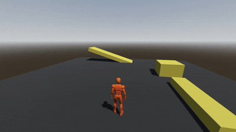

# Real Controller

A third-person character controller for Godot 4.6 with smooth locomotion, camera controls, and animation blending.

Can be found on the [Store](https://store-beta.godotengine.org/asset/furkan-demir/real-controller/) or the [Asset Library](https://godotengine.org/asset-library/asset/furkan-demir/real-controller/).

## Features

- **Camera Mode**: First-person and third-person camera modes
- **Locomotion System**: Walk, run, and sprint with 8-directional movement blending
- **Jump Mechanics**: Ground-based jumping with gravity handling
- **Camera Controls**: Third-person camera with configurable tilt limits and mouse sensitivity
- **Controller Support**: Full gamepad support with analog stick movement
- **Animation System**: Smooth animation blending using AnimationTree
- **Smooth Rotation**: Character mesh rotates smoothly to face movement direction

## Requirements

- Godot 4.6 or later

## Installation

1. Copy the `addons/real-controller` folder into your project's `addons` directory
2. Enable the addon in Project Settings > Plugins
3. Add the character scene (`addons/real-controller/character.tscn`) to your scene or use the example scene

## Setup

How to change the character model? - Real Controller | Godot 4.6 - [Youtube Video](https://www.youtube.com/watch?v=2XPNGCYdZDw)

### Optional: Fix Camera Jitter

If you experience camera jitter (especially on 144Hz+ monitors):

1. Go to **Project → Project Settings**
2. Search for "physics_interpolation"  
3. Enable **Physics > Common > Physics Interpolation**

This enables Godot's built-in smooth camera movement.

### Input Map Configuration

The controller requires the following input actions to be configured in your project:

1. Go to **Project > Project Settings > Input Map**
2. Add the following actions with their corresponding _recommended_ inputs:

| Action | Keyboard | Controller(Optional) |
|--------|----------|------------|
| `forward` | W | Left Stick Up |
| `backward` | S | Left Stick Down |
| `left` | A | Left Stick Left |
| `right` | D | Left Stick Right |
| `jump` | Space | A Button |
| `sprint` | Left Shift | Right Trigger |
| `walk` | Left Alt | - |
| `camera_mode_switch` | V | - |
| `look_up` | - | Right Stick Up |
| `look_down` | - | Right Stick Down |
| `look_left` | - | Right Stick Left |
| `look_right` | - | Right Stick Right |

> **Note**: These input mappings are required for the controller to function properly. Make sure all actions are configured before running the scene. Controller support can be toggled via the `controller_support` export variable.

## Configuration

The controller exposes several export variables for customization:

- **Movement**: Speed, sprint speed, jump velocity
- **Camera**: Mouse sensitivity, controller sensitivity, tilt limit, rotation speed, controller support toggle

If you think camera is too high or too low, you can change Y axis of the CameraPivot node. It will help you to adjust the camera height. 

## Credits

Animations and the Mesh are from the [Basic Motions Free](https://kevdev.itch.io/basic-motions-free).

## Todo

- [ ] Adding new animations from mixamo guide
- [x] Change mesh guide
- [x] Walk
- [ ] Crouch
- [ ] Release mouse when character exits the tree
- [ ] When mouse is not captured, do not handle camera rotation

## License

MIT License - See [LICENCE](LICENCE) file for details.
